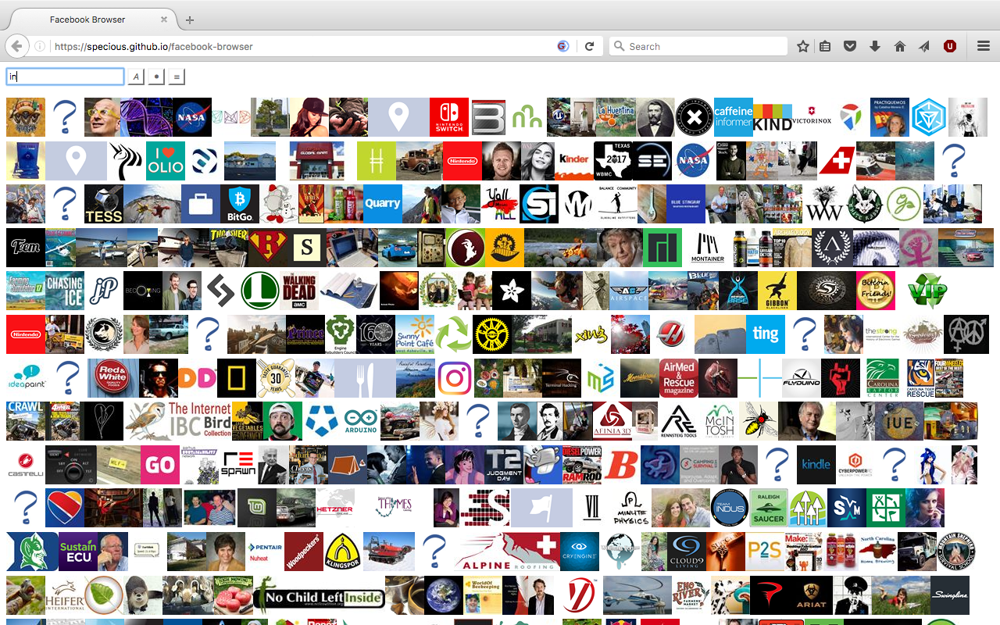

# Facebook Browser

A searchable index of your favorite Facebook pages.



## Setup

The app loads the index of facebook pages from `app/data/index.json', where pages are listed by their id and title:

```json
[
  {"id": "117420464947628", "title": "Seattle's Best Coffee"},
  {"id": "131183430264736", "title": "Maxine Hardcastle"},
  {"id": "2036034379955344", "title": "Bodum"},

  ...
]
```

Thumbnail images are expected to reside in `app/data/images/`, named by their id (no extension).

With [facebook-indexer](https://github.com/specious/facebook-indexer), you can generate the files to browse the Facebook pages that you follow.

## Build and run

Build the interface with:

```
npm install
npm run build
```

Then you can open `app/index.html` in your browser.

## Share online

You can upload your searchable index online and share it.  Everything is in the `app/` directory.

## License

ISC
